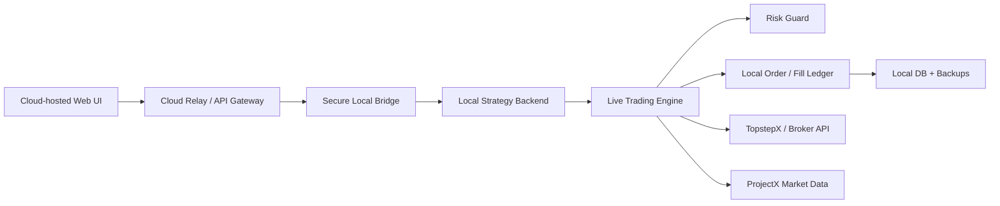

# Local 24/7 Futures Bot Launch Handoff

Date: 2026-05-06  
Last updated: 2026-05-07  
Workspace: `/Users/anishpatel/Documents/SoftwareProject/trading_bot`

## Purpose

This document is the handoff for the next phase of the futures bot: turning the current local live/practice trading app into a reliable always-on system.

The intended architecture is:

- The strategy engine, broker connection, order submission, risk checks, and secrets stay on a local device controlled by the trader.
- The web UI can be hosted in the cloud.
- The cloud UI talks to the local trading engine through a secure bridge.
- The local machine remains the gateway between the strategy backend and the broker.
- The system must be designed so a cloud outage does not stop the local engine from managing risk.

This is not a launch approval. It is the checklist and architecture plan for what must be completed before unattended or semi-unattended 24/7 operation.

## 2026-05-07 Next-Stage Update

Read `NEXT_STAGE_SYSTEM_ARCHITECTURE_HANDOFF.md` first in the next chat. It is the current roadmap for the requested architecture:

- Cloud-hosted frontend UI.
- Private login/account system with no public account creation.
- Always-on Windows PC hosting the broker-facing backend.
- Trading DB kept local to the backend PC at first.
- Optional cloud DB only for auth/session/relay metadata.
- Secure cloud-to-PC bridge before remote control is allowed.
- Mac/Codex development workflow for backtests and strategy updates that does not interrupt the live bot.

UI cleanup completed on 2026-05-07:

- Removed the temporary fake/demo chart trade generator from the live futures chart.
- Removed demo-specific chart popover styling.
- The chart trade dot/popover UI remains available for real live trade decisions only.
- Removed the frontend Create Account button.
- Disabled backend public account registration by default unless `TRADINGBOT_ENABLE_PUBLIC_REGISTRATION=true` is deliberately set.

Important architecture clarification:

- Do not expose the Windows PC backend directly to the public internet.
- Do not put TopstepX/ProjectX credentials in the cloud frontend or frontend container.
- The PC backend should remain the source of truth for live trading state, order/risk state, and the trading database.
- If a cloud frontend is launched before the bridge is complete, keep it read-only or disconnected from broker-facing controls.

## Current Implementation Summary

The current app is a local Java + React trading system.

Backend:

- Java backend under `backend/src/main/java/com/tradingbot`.
- Local HTTP API served by `MainServer.java` on port `7070`.
- Main futures logic lives in `FuturesManager.java`.
- TopstepX / ProjectX connection logic lives in `FuturesConnectionManager.java`.
- ProjectX SignalR live market feed logic lives in `ProjectXRealtimeManager.java`.
- SQLite database is `backend/tradingbot.db`.
- Local historical futures CSV data lives under `backend/market_data/futures`.

Frontend:

- React/Vite frontend under `frontend`.
- Main live trading page is `frontend/src/pages/FuturesLive.jsx`.
- Futures backtest page is `frontend/src/pages/FuturesBacktest.jsx`.
- Current local frontend dev port is `5173`.

Current live workflow:

1. User updates/copies a Backtest Strategy into the Live Strategy slot.
2. User starts the Live Bot.
3. Backend starts ProjectX realtime market data.
4. Backend builds/warmups live candles for each future.
5. Backend runs live signal detection.
6. Backend validates live order sizing/risk.
7. If armed, backend attempts TopstepX practice order submission.
8. UI monitors candles, symbols, PnL, decisions, status, and chart state.

Current tracked futures:

- `MES`
- `MNQ`
- `M2K`
- `ES`
- `NQ`
- `MGC`
- `GC`

Current known practice account:

- TopstepX 150K practice account: `22539378`

Current known Combine account:

- 50K Combine account: `22529998`

## Latest Runtime Sanity Check

Checked on 2026-05-06 after market close.

Runtime state:

- Live session was running as session `21`.
- `PROJECTX_SIGNALR` was active for live price data.
- Warmup data existed for all configured symbols.
- Readiness checks passed.
- Account ID matched the expected 150K practice account.
- Market state was `RTH_CLOSED`.
- The live engine correctly stopped looking for new entries after the regular strategy session closed.
- The flatten/cancel sweep had been attempted after close.
- Metrics showed no accepted trades, no live positions, and `$0.00` PnL.

Important observation:

- Order submission was still armed after market close.
- The market-session gate prevented new entries, but the 24/7 system should automatically disarm after the flatten window.

Live order ledger observation:

- Recent attempted TopstepX practice orders were marked `SUBMIT_BLOCKED`.
- No filled or submitted practice trades were recorded for the checked session.

Verification:

- `npm run build` passed.
- `npm run lint` passed with existing React hook dependency warnings.
- `mvn test` passed: 30 tests, 0 failures, 0 errors.
- Maven emitted JaCoCo warnings about unsupported Java class file major version during instrumentation, but the test run still completed successfully.

## Final Pre-Integration Safety Pass, 2026-05-06

Safety actions completed:

- Found the old local backend still running live session `21` after RTH close with practice order submission armed.
- Disarmed the local practice-order flag, stopped the local live runner, and stopped the ProjectX realtime feed.
- Restarted the backend with the new safety code on `http://localhost:7070`.
- Confirmed `/api/futures/live/status` reports `running:false`.
- Confirmed `/api/futures/live/order-arm` reports `armed:false`.
- Confirmed `/api/futures/live/realtime/status` reports `running:false`.
- Confirmed the local DB order-arm row is `armed=0`, `mode=GUARDED`.
- Confirmed old DB sessions that were still marked `RUNNING` are now `RESTART_LOCKOUT`.
- No broker order, cancel, flatten, paid-data, or account-sync action was triggered during this pass.

Code hardening added:

- Backend startup now forces practice order submission into guarded mode and records a startup lockout audit event.
- Any DB session still marked `RUNNING` at backend startup is moved to `RESTART_LOCKOUT`.
- Practice order submission now blocks and disarms if the RTH strategy entry window is closed.
- Practice order submission now blocks and disarms if ProjectX realtime is not running or the feed is stale.
- The live automation loop now disarms after the post-close flatten/cancel sweep and after critical automation/submission failures.
- Added `/api/system/version` and `/api/system/health` for release and service checks.
- Frontend API calls now use `VITE_API_BASE_URL` via `frontend/src/utils/api.js` instead of hardcoded `localhost` calls.
- Added `.gitignore` and `.env.example` so local DBs, build outputs, and local env files are not accidentally tracked.
- Moved the hardcoded primary account email out of source and into local ignored frontend env config.
- Initialized an empty Git repository on branch `main`; no commit has been created yet.

Verification after changes:

- Backend: `./mvnw test` passed, 30 tests, 0 failures, 0 errors.
- Frontend: `npm run build` passed.
- Frontend: `npm run lint` passed with the existing 5 React hook dependency warnings.
- Backend health endpoint returned `{"ok":true}` after restart.

Still not launch-ready:

- Broker order/fill/position reconciliation is still not complete.
- Live metrics still are not an authoritative broker ledger.
- Shared backtest/live execution parity is still incomplete.
- Alerts, restart preflight depth, DB backup automation, local service packaging, and read-only cloud bridge are still required before 24/7 operation.

## Current Backtest / Live Parity State

Good:

- Backtest and live use the same signal generator, `buildSignals(...)`.
- Live uses a separate frozen Live Strategy slot so live settings do not automatically mutate while research/backtest settings are changing.
- Live strategy updates are blocked while the live runner is active.
- The UI now has a better TradingView-style live monitor with warmup history, current candles, timeframe switching, symbol cards, and status tracking.

Not good enough yet:

- Live execution does not yet fully mirror the backtest execution engine.
- Backtest uses `simulateTrade(...)` with next-bar entry, slippage, target recalculation, adaptive exits, managed stops, daily loss checks, trailing drawdown checks, time exits, and trade counting.
- Live currently uses `validateLiveSignalOrder(...)`, which is thinner and only prepares/validates a bracket order for the broker.
- Live metrics are not yet a true broker ledger because actual fills, partial fills, cancels, realized PnL, and unrealized PnL are not fully reconciled from broker state.

Launch requirement:

- Before 24/7 launch, extract a shared execution/risk engine so backtest, dry-run live, and broker live use the same order intent logic.

## Topstep / Broker Policy Notes

Official Topstep docs need to be checked again before launch, because rules can change.

Relevant current sources:

- TopstepX API Access: https://help.topstep.com/en/articles/11187768-topstepx-api-access
- Trading Combine Parameters: https://help.topstep.com/en/articles/8284197-trading-combine-parameters
- Live Funded Account Parameters: https://help.topstep.com/en/articles/10657969-live-funded-account-parameters
- Trading hours and permitted products: https://help.topstep.com/en/articles/8284206-when-and-what-products-can-i-trade
- VPN policy: https://help.topstep.com/en/articles/8680268-can-i-use-a-vpn
- Prohibited Conduct: https://help.topstep.com/en/articles/10296582-prohibited-conduct

Important rule interpretation for architecture:

- The execution engine should run from the trader's own local device.
- Do not run the order-submitting engine on a VPS or generic cloud server.
- Do not route broker/API trading activity through VPN, proxy, Tor, geolocation masking, or remote-server style setups.
- For Live Funded Accounts, current Topstep docs state that automated trading through the ProjectX API is prohibited. This must be re-confirmed before any Live Funded Account plan.
- A cloud UI can be acceptable only if it is a display/control surface and the actual broker-facing automation remains local and compliant.
- Broker API keys must never be stored in the cloud frontend.

## Target 24/7 Architecture

Preferred mental model:

The cloud side should:

- Host the static web UI.
- Receive status events from the local gateway.
- Send signed control commands to the local gateway.
- Never store broker credentials.
- Never calculate authoritative trade decisions.
- Never be required for the engine to keep managing open risk.

The local side should:

- Own all broker credentials.
- Own all strategy state.
- Own order submission.
- Own position reconciliation.
- Own risk limits and kill-switches.
- Continue running even if the cloud UI is unavailable.

## Local Hosting Reality Check

The backend cannot keep running if the MacBook is turned off. If the trading engine must run 24/7, it needs an always-on local machine.

Recommended hardware path:

1. Best first production choice: dedicated Mac mini or small Linux mini PC.
2. Acceptable research choice: Raspberry Pi 5 with external SSD/NVMe, active cooling, and UPS.
3. Avoid for launch: running from the daily-use MacBook unless the laptop is always plugged in, never sleeps, and is on reliable wired network.

Best practical setup:

- Dedicated mini PC or Mac mini.
- 16 GB RAM preferred.
- 256 GB or larger internal SSD.
- External SSD for encrypted database/log backups.
- Wired Ethernet.
- UPS battery backup.
- Automatic restart after power loss.
- OS sleep disabled.
- Time sync enabled.
- Local admin access without exposing public inbound ports.

Raspberry Pi note:

- A Raspberry Pi can probably run the Java backend and 1-minute strategy logic.
- Do not run from an SD card for production.
- Use SSD/NVMe storage.
- Use active cooling.
- Expect more maintenance and compatibility risk than a mini PC or Mac mini.
- For first serious launch, a small Intel/AMD mini PC or Mac mini is the cleaner bet.

## Secure Bridge Design

The cloud-hosted UI cannot call `localhost:7070` on the local machine. It needs a bridge.

Preferred bridge:

- Local gateway opens an outbound WebSocket connection to a cloud relay.
- Cloud UI connects to the cloud relay.
- Cloud relay forwards read/status/control messages to the local gateway.
- Local gateway translates approved commands into local backend calls.
- Broker traffic goes directly from local machine to broker/API.

Avoid:

- Publicly exposing the backend port to the internet.
- Putting Topstep credentials in the cloud.
- Letting the cloud relay directly submit orders.
- Using VPN/proxy routing for broker traffic.

Security requirements:

- All commands must be authenticated.
- Trade-affecting commands must be signed and audited.
- Add separate permission levels:
  - read-only viewer
  - operator
  - emergency-only operator
  - local admin
- Require explicit confirmation for:
  - arm orders
  - disarm orders
  - start live trading
  - flatten/cancel
  - deploy new engine version
- Add rate limits and replay protection.
- Store secrets only locally, preferably via OS keychain or encrypted config.
- Never commit API keys.

## Required Engine Work Before 24/7 Infrastructure

### 1. Shared Backtest/Live Execution Engine

Create a shared execution module used by:

- portfolio backtest
- live dry-run
- live practice order construction
- future real execution adapter

The shared engine must produce the same order intent for the same completed bars.

It must own:

- signal selection
- strategy ranking
- next-bar entry model
- slippage model
- stop/target calculation
- adaptive reward logic
- early loss cut logic
- time stop logic
- max hold logic
- max initial risk ticks
- contracts sizing
- per-symbol limits
- aggregate funded mini-unit limits
- max open positions
- no-overlap rules
- daily loss guard
- trailing drawdown guard
- forced flat behavior

Acceptance test:

- Replay the same historical day through backtest and live-dry-run mode.
- Decisions, rejects, sizing, stop, target, and intended entry must match.
- Any unavoidable difference must be explicitly logged.

### 2. Broker Order / Fill Reconciliation

Add a real order ledger that syncs with broker state.

Required records:

- order intent
- broker order ID
- bracket/OCO IDs if available
- submitted timestamp
- acknowledged timestamp
- filled timestamp
- partial fill quantity
- average fill price
- stop order state
- target order state
- canceled/rejected reason
- realized PnL
- unrealized PnL
- commission estimate
- current open risk

Required reconciliation loop:

- Poll or stream broker orders.
- Poll or stream broker positions.
- Poll or stream fills/trades.
- Detect mismatch between internal state and broker state.
- Stop new entries on reconciliation failure.
- Alert immediately on unknown position, unknown order, or orphan bracket.

### 3. Risk Guard Hardening

The risk guard must use real account/broker state, not only local assumptions.

Required checks:

- correct account ID
- account can trade
- max position size
- max aggregate mini units
- max open positions
- daily realized and unrealized PnL
- drawdown cushion
- profit target mode
- position flat before hard close
- no new entries after configured cutoff
- no trading during market pause or product close
- no duplicate orders for same signal
- no order submission when feed stale
- no order submission when reconciliation stale
- no order submission after kill switch

Required new behavior:

- Auto-disarm after flatten window.
- Auto-disarm after serious broker/reconciliation failure.
- Auto-disarm after backend restart until a fresh preflight passes.

### 4. Persistent State and Restart Safety

If the local machine restarts mid-session, the engine must recover cleanly.

Required:

- durable engine session table
- durable order ledger
- durable position ledger
- durable strategy snapshot hash
- startup broker reconciliation
- startup market-data freshness check
- startup account/risk check
- restart lockout until preflight passes

No engine should submit a new order immediately after restart until it has:

1. Synced broker account state.
2. Synced open positions.
3. Synced open orders.
4. Confirmed correct account.
5. Confirmed current market session.
6. Confirmed market data freshness.
7. Confirmed active strategy snapshot.
8. Confirmed user/order-arm status.

### 5. Observability and Alerts

The 24/7 version needs alerting before it needs more features.

Required alerts:

- engine started
- engine stopped
- order armed
- order disarmed
- order submitted
- order rejected
- fill received
- partial fill
- bracket missing
- position mismatch
- feed stale
- broker disconnected
- local disk nearly full
- database backup failed
- preflight failed
- flatten sweep failed
- approaching daily loss limit
- approaching max loss / drawdown threshold

Possible alert channels:

- email
- SMS
- Push notification
- Discord private webhook
- local desktop notification

Every alert must also be written into the local audit log.

### 6. Cloud UI / Local Bridge

The current frontend hardcodes local API calls such as `http://localhost:7070`.

For cloud hosting:

- Introduce an API base URL config.
- Split UI into:
  - local dev mode
  - cloud relay mode
- Build a cloud-safe backend relay.
- Build a local bridge service.
- Add authentication before exposing any control surface.

Do not let the cloud frontend directly call broker APIs.

### 7. Deployment and Update System

The current app is a development app. The 24/7 app needs deployment discipline.

Required before unattended launch:

- Version control. No `.git` repository was detected in the checked workspace, so initialize or move this into a proper Git repo before launch.
- Tagged releases.
- Build artifact per release.
- Environment-specific config.
- Secret management.
- Database migrations.
- Backup before migration.
- Rollback plan.
- Release notes.
- Pre-deploy test gate.
- Post-deploy health check.

## Updating Strategy Without Interrupting The Engine

Use three layers:

1. Strategy research
2. Live strategy snapshot
3. Active execution engine

Strategy research:

- Can change freely.
- Used for backtests and experiments.
- Never auto-updates the live engine.

Live strategy snapshot:

- Frozen, versioned, and hashed.
- Contains symbols, strategy settings, risk settings, account profile, source backtest ID, source metrics, and code version.
- Can be updated only when live engine is stopped or in a safe update window.

Active execution engine:

- Runs one strategy snapshot at a time.
- Records the exact snapshot hash on every decision.
- Should not change rules mid-position.

Recommended update patterns:

### Config-only update

Use when changing thresholds, enabled strategies, max trades, or risk values.

Rules:

- Validate in backtest first.
- Promote to a new Live Strategy snapshot.
- Apply only at a bar boundary.
- Prefer applying only when flat.
- Record before/after snapshot IDs.

### Code update

Use when changing signal logic, execution logic, broker logic, or risk code.

Rules:

- Build new version as a separate artifact.
- Start new version in shadow mode first.
- Feed it the same market data.
- Compare decisions against active engine.
- Do not let it submit orders.
- Promote only when flat or after the session close.

### Blue/green local engine

Long-term preferred design:

- `engine-blue` is active and allowed to submit orders.
- `engine-green` runs shadow decisions only.
- Once green passes checks, switch new entries to green.
- Blue continues managing any old open positions until flat.
- Then blue shuts down.

This avoids interrupting live risk management during updates.

Never do this:

- Hot-swap strategy code while a position is open.
- Restart the only engine process while there are unmanaged live orders.
- Deploy database schema changes that the old engine cannot read.
- Push cloud UI changes that can send new command shapes before the local bridge supports them.

## Infrastructure Launch Plan

### Phase 0: Freeze and Version

- Put the project in Git.
- Remove secrets from tracked files.
- Add `.env.example`.
- Add release tags.
- Add a simple version endpoint.
- Add build metadata to live session records.

Exit criteria:

- A clean release can be built and restored.

### Phase 1: Engine Parity

- Extract shared execution/risk engine.
- Build backtest-vs-live replay tests.
- Make live dry-run decisions match backtest order intent.
- Add snapshot hash to decisions.

Exit criteria:

- Same bars plus same snapshot produce same order intent.

### Phase 2: Ledger and Broker Sync

- Implement order/fill/position reconciliation.
- Persist all broker IDs.
- Add unknown-position lockout.
- Add orphan-order detection.
- Add PnL from broker fills.

Exit criteria:

- UI PnL and open positions match broker state.

### Phase 3: Local Daemon

- Package backend as a real service.
- Add `launchd` support for macOS or `systemd` support for Linux.
- Disable machine sleep.
- Add restart policy.
- Add local healthcheck.
- Add local logs and backups.

Exit criteria:

- Engine survives reboot and refuses to trade until preflight passes.

### Phase 4: Secure Bridge

- Build local outbound bridge.
- Build cloud relay.
- Move cloud UI to configurable API base.
- Add auth, command signing, audit, and read-only mode.

Exit criteria:

- Cloud UI can monitor local engine without exposing local broker secrets.

### Phase 5: Paper Endurance Test

- Run practice mode for at least 2 to 4 weeks.
- Keep order size tiny.
- Verify all alerts.
- Verify restart behavior.
- Verify stale feed behavior.
- Verify broker disconnect behavior.
- Verify market close flatten/disarm behavior.

Exit criteria:

- No unmanaged positions.
- No duplicate orders.
- No unexplained PnL mismatch.
- No chart/data desync that affects decisions.
- No rule-boundary surprises.

### Phase 6: Production Decision

- Re-check Topstep rules.
- Confirm account type.
- Confirm allowed execution route.
- Confirm no VPS/VPN/remote-server conflict.
- Confirm trading hours.
- Confirm max position size.
- Confirm drawdown and daily loss rules.
- Decide if the engine remains practice-only, Combine, Express Funded, or Live Funded.

Exit criteria:

- Written launch approval checklist is complete.

## Local Service Options

### macOS launchd

Good for:

- Mac mini.
- Simple local service.
- Native keychain integration.

Needs:

- `.plist` service file.
- working directory set to backend.
- Java path fixed.
- logs redirected to local files.
- `KeepAlive` configured carefully.
- machine sleep disabled.

### Linux systemd

Good for:

- Mini PC.
- Raspberry Pi.
- Headless server.

Needs:

- Java installed.
- dedicated user account.
- `.service` unit.
- restart policy.
- environment file.
- log rotation.
- external SSD mount.

### Docker Compose

Good for:

- reproducible local deployment.
- easy Postgres later.
- clean service boundaries.

Needs:

- careful time sync.
- persistent volumes.
- secret mounts.
- broker/API network must still originate from local device.

Recommended first path:

- Dedicated Linux mini PC with `systemd`, wired Ethernet, UPS, local SSD, and encrypted backups.

## Data and Database Plan

Current SQLite is acceptable for development and possibly initial single-machine practice.

Before 24/7 launch:

- Enable WAL mode.
- Add scheduled backups.
- Add backup verification.
- Store backups on external SSD.
- Keep encrypted off-machine backups for non-secret audit data.
- Add DB size monitoring.
- Add migration scripts.

Consider Postgres when:

- cloud relay needs richer event replication.
- multiple local services write to state.
- order/fill ledger grows.
- audit/reporting becomes heavy.

Do not move broker credentials into cloud Postgres.

## Safety Runbook Draft

Daily start:

1. Local machine awake and on wired network.
2. Time sync healthy.
3. Disk healthy.
4. Backend service healthy.
5. ProjectX feed connected.
6. Correct account selected.
7. Open orders synced.
8. Open positions synced.
9. No unknown broker state.
10. Market session valid.
11. Strategy snapshot correct.
12. Orders manually armed only after preflight.

Daily stop:

1. Stop new entries before cutoff.
2. Confirm no pending entry orders.
3. Flatten/cancel sweep.
4. Confirm broker flat.
5. Disarm orders.
6. Write daily report.
7. Backup database.

Emergency:

1. Press local kill switch.
2. Stop new entries.
3. Attempt broker cancel/flatten.
4. Confirm broker account flat from broker state.
5. Keep engine in read-only mode.
6. Preserve logs.
7. Do not restart into armed mode.

Deploy:

1. Verify no open positions.
2. Disarm orders.
3. Backup database.
4. Build release.
5. Run tests.
6. Start new version in shadow mode.
7. Compare health and decisions.
8. Promote at safe boundary.
9. Keep rollback available.

## Open Specification Questions

These need explicit decisions before building the 24/7 infrastructure:

- What hardware will host the local engine: Mac mini, Linux mini PC, Raspberry Pi, or always-on MacBook?
- Will the cloud UI be read-only first, or will it allow arm/start/stop/flatten commands?
- What alert channel should be used for critical events?
- What should the engine do if broker connectivity drops while a position is open?
- What should the engine do if market data is stale but broker connectivity is healthy?
- What is the maximum acceptable delay between cloud UI status and local engine truth?
- Should all live trading remain RTH-only even though Topstep permits broader electronic hours?
- How long should paper endurance testing run before any Combine or funded attempt?
- What exact account type is the first non-practice target?
- What broker/API route is allowed for that account type?
- What is the update window: after daily close only, weekend only, or any flat state?
- How many days of logs and full audit history should be retained locally?

## Do Not Build Yet

Do not build these until the safety foundation is complete:

- Cloud-hosted broker execution.
- Public inbound backend port.
- Fully autonomous real-account order arming.
- Automatic strategy self-updates.
- Auto-promotion from backtest result into live trading.
- Multi-account copier.
- Any route that uses VPS/VPN/remote server for broker-originating activity.

## Immediate Next Engineering Tasks

1. Create Git/release discipline for the project.
2. Extract shared backtest/live execution engine.
3. Add broker order/fill/position reconciliation.
4. Make live metrics come from broker ledger.
5. Add auto-disarm after close and after critical failures.
6. Add restart-safe preflight lockout.
7. Add local service packaging plan for the chosen hardware.
8. Build cloud/local bridge proof of concept in read-only mode.
9. Add alerts.
10. Run multi-week practice endurance test.

## Launch Readiness Definition

The app is ready for 24/7 local operation only when:

- The local engine can restart safely.
- The local engine refuses to trade after restart until preflight passes.
- The broker ledger matches broker state.
- Backtest and live dry-run produce matching order intent on the same bars.
- Risk gates use real broker state.
- Orders are automatically disarmed outside the allowed session.
- Emergency flatten/cancel is tested.
- Cloud UI can fail without harming local risk management.
- Secrets never leave the local machine.
- Topstep policy has been rechecked for the exact account and API route.
- At least one extended practice run completes with no unexplained state drift.
